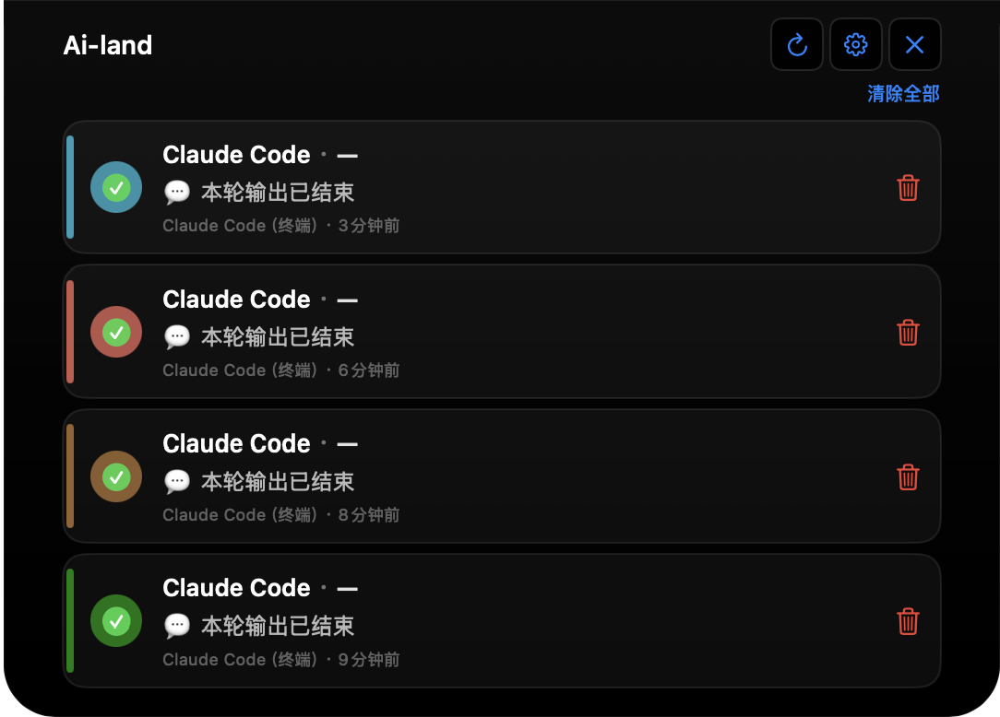
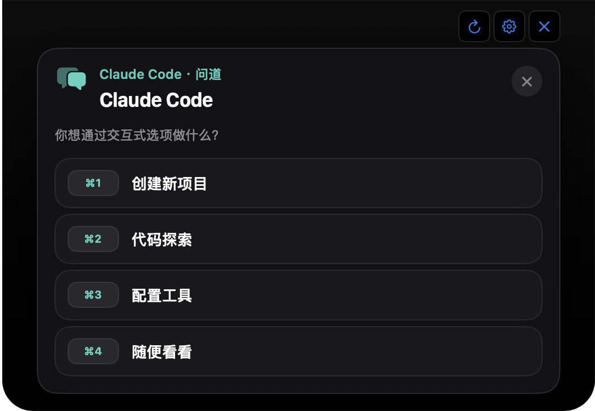
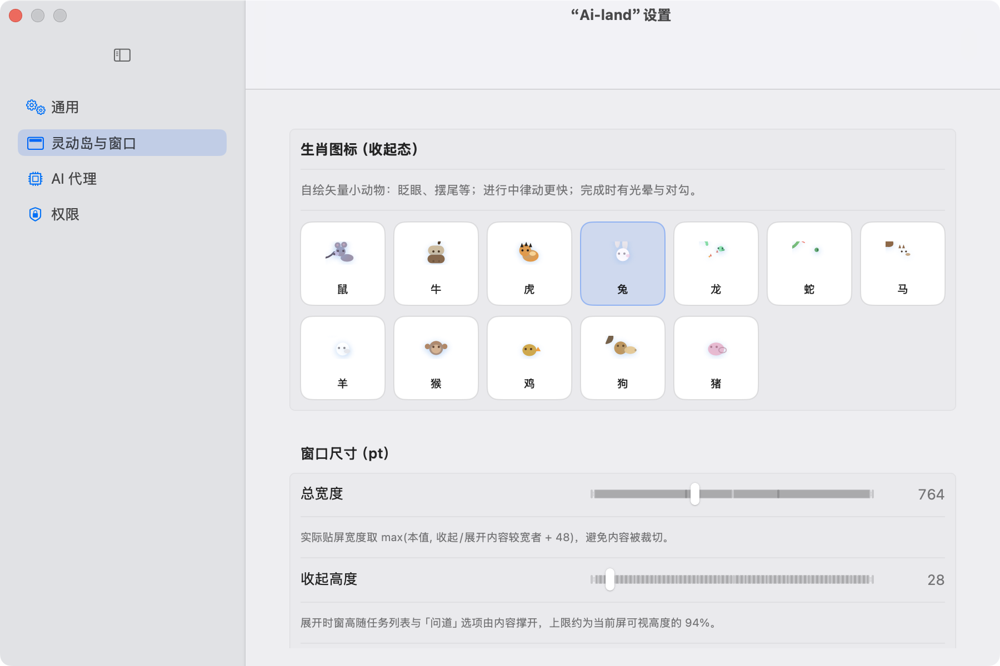
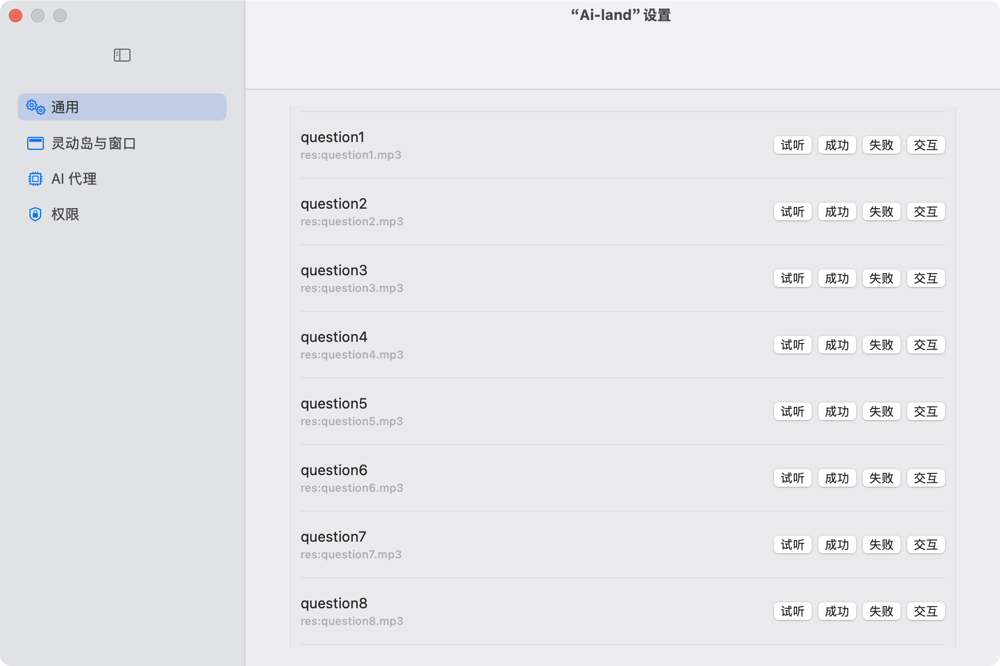

<div align="center">

# Ai-land

**macOS 上的 AI 命令行伴侣**

**简体中文** · [English](README.en.md)

[](LICENSE)
[](https://developer.apple.com/macos/)
[](https://swift.org)
[](https://developer.apple.com/xcode/)

<br/>

</div>

> 以「灵动岛」式悬浮条展示 CLI 任务、审阅询问与完成状态，并与多款编码代理（Claude Code、Codex、Gemini CLI 等）通过钩子与本地通道联动。

## 简介

**Ai-land** 是原生 Swift / SwiftUI 应用，窗口贴在屏幕边缘，收起时以紧凑形态展示状态；展开后可浏览任务列表、处理代理发起的确认选项，并通过自定义 URL 与外部工具协作跳转。


## 功能概览

- **任务岛**：展示来自终端代理的进行中 / 待确认 / 已完成任务，支持预览与跳转相关工作区窗口。
- **交互面板**：聚合「问道」类选项（允许/拒绝工具权限等），快捷键与列表操作与岛上 UI 一致。
- **生肖紧凑态**：收起态可使用十二生肖像素风小动效（可随设置调整）。
- **多代理**：检测并配置多种 CLI 的 hooks，设置中可查看状态与快速安装钩子。
- **声音与本地化**：内置提示音资源；界面支持简体中文与英文（`zh-Hans` / `en`）。

## 支持的 AI CLI / 代理

| 显示名称 | 可执行名 | Hooks 目录（示例） |
|----------|----------|-------------------|
| Claude Code | `claude` | `~/.claude/hooks` |
| OpenAI Codex CLI | `codex` | `~/.codex/hooks` |
| Google Gemini CLI | `gemini` | `~/.gemini/hooks` |
| Cursor Agent | `cursor` | `~/.cursor/hooks` |
| OpenCode | `opencode` | `~/.opencode/hooks` |
| Factory Droid | `droid` | `~/.droid/hooks` |

具体路径与安装逻辑以 `ConfigurationManager` 与设置界面为准。

## 系统要求

- **macOS 15.5** 或更高版本（以 Xcode 工程 `MACOSX_DEPLOYMENT_TARGET` 为准）
- **Xcode**（建议当前稳定版）用于从源码编译

## 从源码构建与运行

1. 克隆仓库：
   ```bash
   git clone https://github.com/oyyxmmd/Ai-land.git
   cd Ai-land
   ```
2. 用 Xcode 打开 **`Ai_land.xcodeproj`**。
3. 选择 Scheme **`Ai_land`**，目标为 **My Mac**，运行（⌘R）。

首次运行可能需在系统设置中授予**自动化 / Apple Events**等相关权限（用于窗口与终端协作，见 `Info.plist` 中的用途说明）。

## URL Scheme（深度链接）

应用注册以下 scheme，可供外部工具或脚本唤起并传参（具体参数以 `AiLandURLRouting` 与相关文档为准）：

- `ai-land://…`
- `code-island://…`（兼容旧名）

`assistant` 参数为各 CLI 的可执行名（小写），例如 `claude`、`codex`、`gemini`、`cursor`、**`opencode`**、`droid`；也支持显示名/别名（如 `OpenCode`、`open-code`），应用内会规范为可执行名。

示例（OpenCode 任务进行中）：

```text
open -g "ai-land://task?assistant=opencode&state=running&task_id=demo&title=Demo"
```

## 仓库结构（简要）

```
Ai_land/           # 主应用源码（SwiftUI、岛式 UI、任务与交互逻辑）
Ai_landTests/      # 单元测试
Ai_landUITests/    # UI 测试
Ai_land.xcodeproj/ # Xcode 工程
music/             # 提示音等音频资源
docs/              # 设计与计划文档（superpowers 等）
Info.plist         # 与工程配合的附加 Info 配置
```

## 许可证

本项目以 **Apache License 2.0** 发布，见仓库根目录 [`LICENSE`](LICENSE)。

## 链接

- 源码与 Issue：<https://github.com/oyyxmmd/Ai-land>

## 其他

非专业开发，肯定会存在部分问题，欢迎提 Issue。同时大家可以自行修改，特邀一起共建此项目，欢迎 PR。

## 以下是部分预览图









---

<p align="center"><b>简体中文</b> · <a href="README.en.md">English</a></p>

